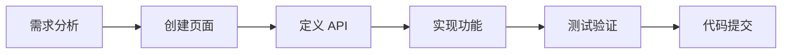

# 墨小帮后台管理系统 - 文档中心

## 文档导航

欢迎使用墨小帮后台管理系统文档中心。这里包含了项目的完整文档和开发规范。

### 📚 核心文档

| 文档 | 说明 | 适用人群 |
|------|------|----------|
| [项目概述](./PROJECT_OVERVIEW.md) | 项目简介、技术栈、目录结构 | 所有人 |
| [快速开始](./QUICK_START.md) | 环境准备、项目启动、开发流程 | 新手开发者 |
| [开发规范](./DEVELOPMENT_GUIDE.md) | 代码规范、组件使用规范、业务开发规范 | 所有开发者 |
| [组件使用指南](./Component_GUIDE.md) | 核心组件使用方法和示例 | 所有开发者 |
| [API 接口规范](./API_SPECIFICATION.md) | API 定义规范、请求响应格式 | 后端对接、前端开发 |
| [路由配置指南](./ROUTING_GUIDE.md) | 路由配置、动态路由、菜单管理 | 前端开发 |
| [新旧项目对比](./NEW_VS_OLD_COMPARISON.md) | Vue到React迁移对比分析 | 技术负责人、开发者 |

### 🔄 迁移文档

| 文档 | 说明 | 适用人群 |
|------|------|----------|
| [迁移方案总览](./迁移方案/README.md) | Vue到React完整迁移方案 | 项目经理、技术负责人 |
| [质押挖矿迁移报告](./PLEDGE_MIGRATION_REPORT.md) | pledge模块迁移详细报告 | 开发者 |

## 快速导航

### 🚀 快速开始

如果你是第一次接触本项目，建议按以下顺序阅读：

1. **[项目概述](./PROJECT_OVERVIEW.md)** - 了解项目整体情况
2. **[快速开始](./QUICK_START.md)** - 快速搭建开发环境
3. **[开发规范](./DEVELOPMENT_GUIDE.md)** - 熟悉开发规范
4. **[组件使用指南](./Component_GUIDE.md)** - 学习核心组件使用

### 💡 常用功能

#### 创建新页面
参考：[快速开始 - 创建新页面](./QUICK_START.md#1-创建新页面)

#### 添加 API 接口
参考：[快速开始 - 添加 API 接口](./QUICK_START.md#2-添加-api-接口)

#### 完整 CRUD 开发
参考：[快速开始 - 完整的 CRUD 页面](./QUICK_START.md#3-完整的-crud-页面)

#### 核心组件使用
- **CmBasePage**：[组件使用指南 - CmBasePage](./Component_GUIDE.md#1-cmbasepage---通用列表页面组件)
- **DataForm**：[组件使用指南 - DataForm](./Component_GUIDE.md#2-dataform---通用表单组件)
- **CmUpload**：[组件使用指南 - CmUpload](./Component_GUIDE.md#3-cmupload---图片上传组件)
- **CmEditor**：[组件使用指南 - CmEditor](./Component_GUIDE.md#4-cmeditor---富文本编辑器)

### 🔍 问题排查

#### 常见问题
- **API 请求失败**：[快速开始 - 常见问题](./QUICK_START.md#2-api-请求失败)
- **组件不刷新**：[快速开始 - 常见问题](./QUICK_START.md#4-组件不刷新)
- **路由问题**：[路由配置指南 - 常见问题](./ROUTING_GUIDE.md#常见问题)
- **表格问题**：[组件使用指南 - 常见问题](./Component_GUIDE.md#常见问题)

## 项目结构概览

```
moxiaobang-admin/
├── docs/                    # 📖 项目文档
├── src/
│   ├── api/                # 🔌 API 接口
│   ├── components/         # 🧩 通用组件
│   ├── pages/              # 📄 页面组件
│   │   ├── cm-system/     # 系统管理模块
│   │   ├── cm-portal/     # 门户内容模块
│   │   └── system-setting/ # 系统设置模块
│   ├── router/             # 🛣️ 路由配置
│   ├── contexts/           # 📦 Context
│   └── config/             # ⚙️ 配置文件
├── vite.config.js         # Vite 配置
└── package.json           # 项目依赖
```

## 核心功能模块

### 系统管理模块 (cm-system)
- 用户管理
- 角色管理
- 菜单管理
- 组织管理
- 字典管理
- 日志管理

### 门户内容模块 (cm-portal)
- 文章管理
- 产品管理
- 视频管理
- 留言管理
- 配置管理

### 系统设置模块
- 个人中心
- 通知中心
- 系统配置

## 开发工作流



### 详细步骤

1. **需求分析**：明确功能需求和技术方案
2. **创建页面**：按照规范创建页面组件
3. **定义 API**：在 `src/api/modules/` 中定义接口
4. **实现功能**：使用核心组件实现业务逻辑
5. **测试验证**：测试功能是否正常
6. **代码提交**：提交代码前确保符合规范

## 技术栈

### 核心技术
- **React 18.2.0** - 前端框架
- **Vite 5.0.8** - 构建工具
- **React Router DOM 6.3.0** - 路由管理
- **Ant Design 5.4.0** - UI 组件库

### 开发工具
- **ESLint** - 代码检查
- **Vite** - 构建和开发服务器
- **axios** - HTTP 客户端

## 规范和约定

### 命名规范
- 组件文件：PascalCase（如 `UserPage.jsx`）
- 工具文件：camelCase（如 `formatDate.js`）
- 组件名：PascalCase（如 `UserPage`）
- 函数名：camelCase（如 `handleSubmit`）

### 目录组织
- 按功能模块划分
- 每个模块包含页面和私有组件
- 通用组件放在 `src/components/`

### API 定义
- 按业务模块组织
- 统一命名规范
- 集中在 `src/api/modules/`

## 常用命令

```bash
# 安装依赖
npm install

# 启动开发服务器
npm run dev

# 构建生产版本
npm run build

# 预览构建
npm run preview

# 代码检查
npm run lint
```

## 开发环境配置

### API 代理
开发环境下，API 请求会代理到：
```
http://172.16.102.105:4002/
```

可在 [vite.config.js](../vite.config.js) 中修改。

### 端口配置
开发服务器默认端口：`3000`

## 学习资源

### 官方文档
- [React 官方文档](https://react.dev/)
- [Ant Design 文档](https://ant.design/)
- [Vite 文档](https://vitejs.dev/)
- [React Router 文档](https://reactrouter.com/)

### 项目文档
- [React Hooks 最佳实践](https://react.dev/reference/react)
- [Ant Design Pro 组件](https://procomponents.ant.design/)

## 版本信息

- **当前版本**：1.0.0
- **React 版本**：18.2.0
- **Ant Design 版本**：5.4.0
- **Vite 版本**：5.0.8

## 更新日志

### v1.0.0 (当前版本)
- 初始版本发布
- 完成核心功能模块
- 完成文档编写

## 贡献指南

### 代码贡献
1. Fork 项目
2. 创建特性分支
3. 提交更改
4. 推送到分支
5. 创建 Pull Request

### 文档贡献
- 发现文档错误或不足
- 有更好的示例代码
- 有改进建议

欢迎提交 Issue 或 Pull Request！

## 许可证

本项目为内部项目，版权归公司所有。

## 联系方式

如有问题，请联系：
- 技术支持团队
- 项目负责人

---

**最后更新时间**：2024年3月7日

**文档版本**：v1.0.0
